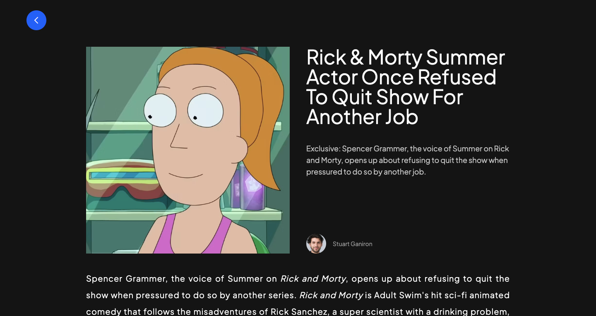

# Blog App (not responsive)

This is a blog app, coded with Nextjs and tailwind + graphcms.

You can add comments (they'll be shown after getting accepted in the graphcms), sort articles by category, search for specific articles and read them.

## Screenshots



## Get started

Install all modules and their dependencies listed on package.json file:

```bash
npm install
```

Run the app on localhost:

```bash
npm run dev
```

## Built with

- Nextjs
- Tailwind
- GraphQL
- GraphCMS
