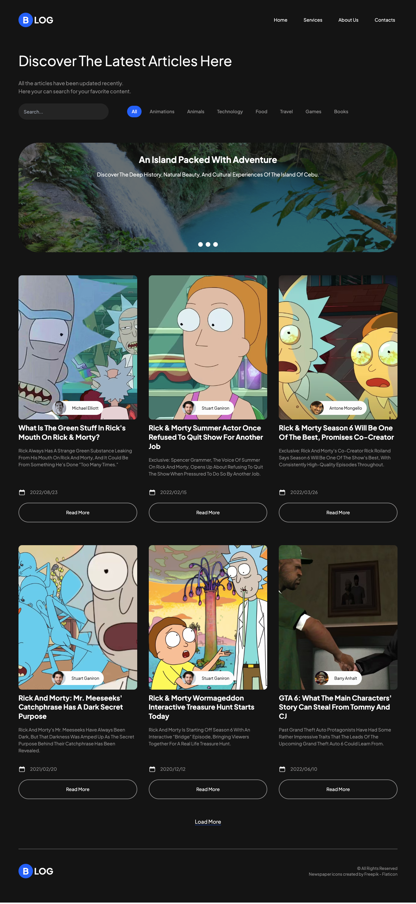

# Blog App

This blog app is coded with NextJS and Tailwind + GraphCMS(hygraph).

## You can:

- Add comments under the posts and they'll be shown after being accepted by the admin (me😁)
- Sort the visible articles by category
- Search for specific articles

## Screenshots




## Get started

Install all modules and their dependencies listed on package.json file:

```bash
npm install
```

Run the app on localhost:

```bash
npm run dev
```

## Built with

- NextJS
- Tailwind
- GraphQL
- GraphCMS(hygraph)
